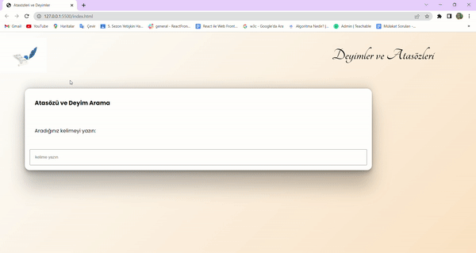

# Dictionary

 

Merhabalar,Harici bir veri kaynağı (JSON API) üzerinden sorgulama yaparak veri çekme ve listeleme uygulamasıdır. Uygulama içerisinde Fetch fonksiyonu ile sunucudan veri çekme, Async/await kullanımı, Arama kriterleri için RegExp kullanımı,Dizii çinde rastgele sıralama ve tekrarlı kayıtları teke düşürme gibi uygulamalara yer verilmiştir.

 
   
   📜​✒️​
 
